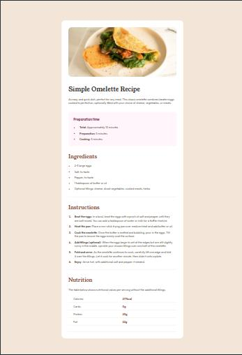

# Frontend Mentor - Recipe page solution

This is a solution to the [Recipe page challenge on Frontend Mentor](https://www.frontendmentor.io/challenges/recipe-page-KiTsR8QQKm). Frontend Mentor challenges help you improve your coding skills by building realistic projects. 

## Table of contents

- [Overview](#overview)
  - [The challenge](#the-challenge)
  - [Screenshot](#screenshot)
  - [Links](#links)
- [My process](#my-process)
  - [Built with](#built-with)
  - [What I learned](#what-i-learned)
  - [Continued development](#continued-development)
  - [Useful resources](#useful-resources)
- [Author](#author)

## Overview

### Screenshot

### Links

- Solution URL: [Add solution URL here](https://your-solution-url.com)
- Live Site URL: [Add live site URL here](https://recipe-main-page-edson.netlify.app/)

## My process

### Built with

- Semantic HTML5 markup
- CSS custom properties
- Flexbox
- Mobile-first workflow

### What I learned

The "main" tag wraps the recipe content to display at the center of desktop screen (it contains a main image and five sections - including the header and steps of the recipe).

### Continued development

Using flexbox.

### Useful resources

- [HTML Semantic Elements](https://www.w3schools.com/html/html5_semantic_elements.asp)
- [HTML CSS How to stop a table cell from expanding](https://stackoverflow.com/questions/1236148/html-css-how-to-stop-a-table-cell-from-expanding)
- [CSS table-layout Property](https://www.w3schools.com/cssref/pr_tab_table-layout.php)

## Author

- Frontend Mentor - [@rodriguesedson](https://www.frontendmentor.io/profile/rodriguesedson)
- Twitter - [@rodrigues.edson](https://x.com/edson_rodr1gu3s)
